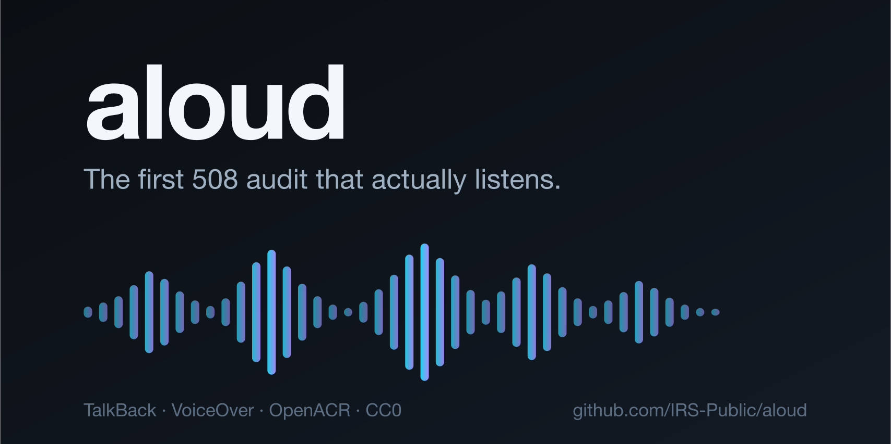

# aloud

**The first 508 audit that actually listens.**

[](https://github.com/IRS-Public/aloud/actions/workflows/ci.yml)
[](LICENSE)
[](package.json)

aloud drives real screen readers across the screens of your mobile app. It
captures what they actually speak. It runs Section 508 / WCAG checks on the
accessibility tree of each screen. It writes per-screen speech transcripts,
an HTML evidence page, and a draft OpenACR conformance report.

- **Android**: real TalkBack, built from Google's source at a pinned commit.
  The transcript is what TalkBack spoke, captured from its speech log.
- **iOS**: computed VoiceOver transcripts by default. Opt-in real speech
  through Xcode 27's `XCUIVoiceOverService` uses
  `--voiceover real --no-gate` and labels traversal as partial.

Both audit legs have passed real CI runs on the IRS mobile app project it
was built for.

## Why

508 audit tools today do not listen. Static scanners check the
accessibility tree and stop there. But the DHS Trusted Tester methodology
for mobile names its test instruments plainly: VoiceOver and TalkBack. A
conformant audit uses the screen reader itself. aloud automates exactly
that. It runs the instrument, records the speech, and turns the evidence
into a report.

One more reason the name fits: "audit" comes from the Latin *audire*, to
hear. The first audits were hearings. This one is too.

## Try it in 60 seconds

No emulator, no simulator, no setup. The demo replays a captured audit of a
bundled sample screen through the real pipeline:

```bash
git clone https://github.com/IRS-Public/aloud && cd aloud && npm install
npx aloud demo
```

Here is the demo screen's captured TalkBack transcript:

```text
Order status, heading
Your order shipped on Tuesday, August 25th.
Track package, button
Unlabeled, button
Cancel order, button
```

Line four is the audit. A static scanner logs "missing contentDescription"
in a table. aloud shows you the moment a blind user reaches a share button
and hears the word "Unlabeled". The demo report fails that screen on two
real findings: the unlabeled control, and a cancel button smaller than the
touch-target minimum. If your machine has a text-to-speech voice, the
report also reconstructs the transcript as playable audio, labeled as a
reconstruction.

## Quickstart

aloud is a standalone CLI. Point it at an app build. Get transcripts and a
draft OpenACR. You do not need CI, and you do not need to change your app.
Install it as in the demo above, then write a small config (see `examples/aloud.config.example.json`). Save it as
`aloud.config.json` in your project root.

```json
{
  "app": {
    "name": "Example App",
    "version": "1.0.0",
    "android": { "package": "com.example.app", "apk": "build/app-debug.apk" },
    "ios": { "bundleId": "com.example.app", "app": "build/Example.app" }
  }
}
```

### Android

You need a running emulator with a `google_apis` (userdebug) image, and a
TalkBack APK (Google ships no prebuilt one, so aloud builds it from source
at a pinned commit and caches it):

```bash
npx aloud talkback get --build
npx aloud talkback install .aloud-cache/talkback.apk
npx aloud android --apk path/to/app-debug.apk
open aloud-report/android/index.html
```

On an x86_64 emulator, install `.aloud-cache/talkback-nolib.apk` instead.
The pinned TalkBack build ships ARM native libs only.

The first run exits with a failure: findings gate against a baseline, and
no screen is in one yet. Accept the current counts:

```bash
npx aloud baseline aloud-report/android
```

The gate is a ratchet: from that baseline, per-screen error counts can only
go down, and a rule id the baseline has never seen fails. Pass `--no-gate`
to skip the gate instead.

### iOS

You need macOS, a booted simulator, and `idb` (accessibility tree dumps):

```bash
npx aloud ios --app path/to/YourApp.app
open aloud-report/ios/index.html
```

Same first-run rule as Android: accept the baseline with
`npx aloud baseline aloud-report/ios`, or pass `--no-gate`.

To also collect Apple's per-screen accessibility audit, install `xcodegen`
and use a configured Xcode 15+ with an iOS 17+ simulator:

```bash
brew install xcodegen
npx aloud ios --apple-audit --no-gate
```

This opt-in integration adds contrast, hit-region, text-clipping, and other
Apple findings to the evidence page. Findings are **report-only** while the
integration is calibrated; they do not change the tree-check gate or
OpenACR conformance levels. A failed or incomplete native capture stops the
run. See [docs/ios.md](docs/ios.md#apple-accessibility-audit-opt-in).

### Draft OpenACR

Run this after the baseline step: with no flags, `openacr` reads the
baselines you accepted above.

```bash
npx aloud openacr
```

To draft from a fresh run without a baseline, pass the report dirs:
`npx aloud openacr --report aloud-report/android --report-ios aloud-report/ios`.

This emits `acr-draft.yaml`, a machine-readable accessibility conformance
report in the GSA [OpenACR](https://github.com/GSA/openacr) format. It is a
draft on purpose: only criteria the automated rules cover get a conformance
level, and every note says so. See [docs/openacr.md](docs/openacr.md).

With zero setup, aloud audits whatever screen is currently open
(`--nav current-screen`, the default). Give it a screens manifest
(`examples/screens-deeplinks.example.json`) to walk your whole app by deep
links, or use bridge mode (`examples/screens-bridge.example.json`) for apps
with a dev navigation hook. See
[docs/how-it-works.md](docs/how-it-works.md).

## Run it in CI (optional)

aloud runs fine on GitHub-hosted runners. Copy the templates in
[`examples/ci/`](examples/ci/):

- [`examples/ci/android-audit.yml`](examples/ci/android-audit.yml): boots a
  headless emulator with KVM, builds TalkBack once and caches it, runs the
  audit, uploads the evidence page.
- [`examples/ci/ios-audit.yml`](examples/ci/ios-audit.yml): boots a
  simulator on a macOS runner, installs `idb` from a pinned tarball, runs
  the audit, uploads the evidence page.

Both templates use only GitHub-owned actions. See [docs/ci.md](docs/ci.md).

## How it works

**Android** runs two passes per screen. Pass one: TalkBack is on, and
logcat markers bracket each screen so TalkBack's verbose speech log can be
sliced into a per-screen spoken transcript. Pass two: TalkBack is off, and
`uiautomator dump` feeds the 508 rule checks plus an evidence screenshot.
Two passes because `uiautomator` evicts running accessibility services, so
the tree pass would kill TalkBack mid-speech.

**iOS** runs one pass. `idb` dumps the accessibility tree per screen. aloud
computes the VoiceOver utterance for each element (label, value, trait,
hint) and runs the iOS rule checks. The transcript is labeled
`computed-voiceover`. Opt-in `--voiceover real --no-gate` records actual
speech with `source: "voiceover"`, raw capture evidence, and explicit partial
coverage. Partial speech cannot pass the gate. Requirements and screen-state
limits are documented in [docs/ios.md](docs/ios.md).

Findings gate against a per-screen baseline you accept explicitly with
`aloud baseline`. It is a ratchet: counts only go down, and a rule id the
baseline has never seen fails even under the count.

Full pipeline, rule tables, and known limits:
[docs/how-it-works.md](docs/how-it-works.md).

## Bugs it has actually found

aloud's transcripts were read against a real IRS-app feature branch after
the tree checks had passed every screen. Three findings surfaced. Chasing
each to root cause improved the tool more than the app, which is the
honest shape of dogfooding:

- **"Paperless notices, 1."** Preference toggles appeared to announce a raw
  numeric state. Root cause: a UISwitch dumps `AXValue "1"` through the
  mac-AX bridge, but real VoiceOver speaks "on". The *transcript* was
  wrong, not the app. Fixed: switch-family numeric state now normalizes to
  on/off, and RN's Switch (which surfaces as `CheckBox`) is recognized as
  a switch. A new `ios-toggle-raw-value` warning covers the genuinely
  broken shape, a non-switch control wearing numeric state, and stays out
  of text fields and sliders, where a "1" is content.
- **Roster rows intermittently losing their button trait.** In walk-time
  dumps, two of six visually identical client rows read as static text; in
  settled dumps all six carry the trait. The app's code was right. The
  dump can race the accessibility tree's realization. Fixed at the cause:
  the walker now re-dumps until two consecutive dumps agree. The new
  `ios-list-row-not-interactive` warning still flags a static row sitting
  in a column of interactive siblings, so a real lost trait gets human
  review instead of a silent pass.
- **A switch flagged for being 51x31pt.** Adding CheckBox to the
  interactive set tripped the 44pt target rule on Apple's own UISwitch
  geometry. Apple's audit passes it; aloud now exempts switch-family
  roles from the platform-minimum rule.

The meta-lesson is the tool's thesis restated: the dump is not the speech.
Every one of these was invisible to a static tree check and surfaced only
by reading what VoiceOver would say.

## Status and roadmap

Working today, proven in CI:

- Android TalkBack transcripts and tree checks, two-pass.
- iOS computed VoiceOver transcripts and tree checks.
- Ratchet gate, HTML evidence page, draft OpenACR emitter.

Roadmap, in implementation order:

1. **Per-screen Apple accessibility audits.** The opt-in `--apple-audit`
   integration is available for validation on iOS 17+. Keep native findings
   report-only until real-app fixtures establish useful severity and
   coverage. This work does not depend on the VoiceOver beta API.
2. **Real VoiceOver on iOS.** Opt-in per-screen capture preserves raw speech,
   target identity, and explicit partial coverage. A verified completion
   signal and GA toolchain validation remain required before it becomes the
   default. Today's baselines store tree errors, so no transcript migration
   is needed. [Tracking #23](https://github.com/IRS-Public/aloud/issues/23).
3. **TalkBack focus stepping.** Build and test a companion that drives
   TalkBack's accessibility focus, including scroll boundaries, repeated
   labels, and explicit completion. Shell key injection alone is not a
   verified full-traversal mechanism.
4. **A logging TTS engine.** Capture speech requests with sequence IDs,
   screen boundaries, and queue/flush events. Prove that requests survive
   stress and distinguish requested speech from audio actually played.
5. **Deeper Android checks.** Integrate Google's Accessibility Test
   Framework and richer node data after the capture protocol is stable.
   Preserve check provenance and verify each rule's coverage before it can
   change OpenACR results.

Acceptance criteria and dependencies: [technical roadmap](docs/roadmap.md).

## Prior art, and the word "first"

Static scanners (axe, Accessibility Scanner, Xcode's audit) inspect markup
or the accessibility tree. They are useful, and aloud runs tree checks too.
But they do not run a screen reader, so they cannot tell you what a blind
user hears. Projects like ARIA-AT drive real screen readers to test
interoperability on the web, not to audit an app. Commercial screen-reader
automation exists in beta. As far as we know, no open tool before aloud
combined all four: crawl an app's screens, drive the real screen readers,
assert on the captured speech, and emit 508/OpenACR reporting. If we are
wrong, open an issue; we would genuinely like to know.

|  | aloud | Static scanners (axe, Accessibility Scanner) | Xcode audit | ARIA-AT | Commercial beta tools |
| --- | --- | --- | --- | --- | --- |
| Runs the real screen reader | Yes* | No | No | Yes | Yes |
| Captures the spoken output | Yes* | No | No | Yes | Yes |
| Walks every screen of a mobile app | Yes | No | Only screens your UI tests visit | No, web only | Varies |
| Section 508 / OpenACR reporting | Yes | No | No | No | No |
| Open source | Yes, CC0 | Core only | No | Yes | No |

\* Real TalkBack on Android today. On iOS the default transcript is computed and
labeled as computed; opt-in real VoiceOver captures are partial on Xcode 27
GA, with the experimental harness already in this repo.

## License

This project is dedicated to the public domain under
[CC0 1.0 Universal](LICENSE). It was developed as a work of the United
States federal government, following the precedent of IRS Direct File. You
may copy, modify, and use it, for any purpose, without permission or
attribution.

## Contributing and security

See [CONTRIBUTING.md](CONTRIBUTING.md) and [SECURITY.md](SECURITY.md).

### Full TalkBack traversal (opt-in)

`aloud android --talkback focus` uses a companion built from the pinned TalkBack
source. It captures real focus steps and speech requests, including scrolling,
and rejects incomplete traversal. See [setup, evidence, and limitations](docs/talkback-focus.md).
